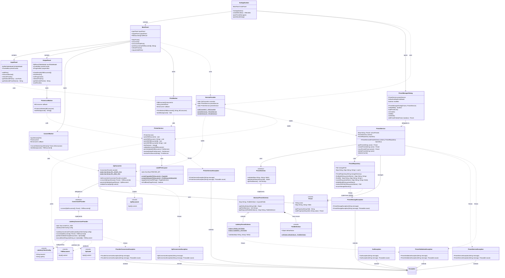

# ZPL-RDR – UML Class Diagram

```mermaid
classDiagram
    direction TB

    %% Interfaces (SPI / Strategy Patterns)
    class ConversionProvider {
        <<interface>>
        +convert(ZplDocument[], Preset) PdfDocument[]*
    }

    class PresetSchema {
        <<interface>>
        +validate(Map~String, String~ fields)*
        +getDefaultValue(String field) Object
        +getFieldNames() Set~String~
    }

    %% Value Objects / Records (Domain Payload)
    class PdfDocument {
        <<record>>
        +byte[] content
    }

    class ZplDocument {
        <<record>>
        +byte[] content
    }

    %% Labelary Sub-package payload
    class ZplLabel {
        <<record>>
        +byte[] content
    }

    %% Domain models
    class Preset {
        <<record>>
        +String name
        +Map~String, String~ fields
        +getProperty(String field) String
        +withProperty(String field, String value) Preset
    }

    %% Repository Pattern
    class PresetRepository {
        -Path storagePath
        -Map~String, Map~String, String~~ cache
        +PresetRepository(String storageDirectory)
        +findById(String presetName) Map~String, String~
        +findAll() Map~String, Map~String, String~~
        +save(String presetName, Map~String, String~ fields)
        +deleteById(String presetName)
        -resolveFilePath(String presetName) Path
        -ensureStorageDirectory()
    }

    %% Abstract Base (Template Method Pattern)
    class AbstractPresetSchema {
        -Map~String, FieldDefinition~ requiredFields
        +getDefaultValue(String field) Object
        +getFieldNames() Set~String~
        #getRequiredFieldDefinitions() Map~String, FieldDefinition~
    }

    class FieldDefinition {
        <<record>>
        +Object defaultValue
        +of(Object defaultValue)$ FieldDefinition
    }

    %% Configuration
    class LabelaryClientConfig {
        <<record>>
        +String baseUrl
        +String apiKey
    }

    %% Error Handling (Granular Exceptions)
    class PresetValidationException {
        +PresetValidationException(String message)
        +PresetValidationException(String message, Throwable cause)
    }

    class ProviderConversionException {
        +ProviderConversionException(String message)
        +ProviderConversionException(String message, Throwable cause)
    }

    class PresetServiceException {
        +PresetServiceException(String message)
        +PresetServiceException(String message, Throwable cause)
    }

    class ZplConversionException {
        +ZplConversionException(String message)
        +ZplConversionException(String message, Throwable cause)
    }

    class PresetStorageException {
        +PresetStorageException(String message)
        +PresetStorageException(String message, Throwable cause)
    }

    class PrinterServiceException {
        +PrinterServiceException(String message)
        +PrinterServiceException(String message, Throwable cause)
    }

    class GuiException {
        +GuiException(String message)
        +GuiException(String message, Throwable cause)
    }

    %% Implementations
    class LabelaryConversionProvider {
        -static final int BATCH_SIZE
        -LabelaryClientConfig config
        +LabelaryConversionProvider(LabelaryClientConfig config)
        +convert(ZplDocument[], Preset) PdfDocument[]*
        -partitionIntoBatches(ZplDocument) ZplLabel[][]
        -executeBatchRequest(String url, ZplLabel[]) PdfDocument
    }

    class LabelaryPresetSchema {
        -Pattern DPMM_PATTERN$
        -Pattern NUMERIC_PATTERN$
        +validate(Map~String, String~ fields)*
    }

    %% Orchestration (Service / Facade Patterns)
    class ZplConverter {
        -ConversionProvider provider
        -static final String ZPL_START_TAG$
        -static final String ZPL_END_TAG$
        +ZplConverter(ConversionProvider provider)
        +convertAll(InputStream[], Preset) PdfDocument[]*
        -parseAndValidate(InputStream) ZplDocument
        -validateFormat(byte[] content)
    }

    class PresetService {
        -Map~String, Preset~ activePresets
        -PresetSchema schema
        -PresetRepository repository
        +PresetService(PresetSchema schema, PresetRepository repository)
        +getPreset(String name) Preset
        +createPreset(String name) Preset
        +savePreset(Preset preset) Preset
        +deletePreset(String name)
        -initializeCache()
    }

    %% Print Service
    class PrinterService {
        +PrinterService()
        +print(PdfDocument) void
        +print(PdfDocument, String) void
        +printAll(PdfDocument[]) void
        +printAll(PdfDocument[], String) void
        +listPrinters() String[]
        -validateDocument(PdfDocument)
        -printValidated(PdfDocument, PrintService)
        -resolveDefaultPrintService() PrintService
        -resolvePrintService(String) PrintService
    }

    class LabelPrintLayout {
        -static final float PRINTER_DPI
        +createPageable(PDDocument)$ Pageable
        +createAttributes(PDDocument)$ PrintRequestAttributeSet
        +pageSizeInches(PDPage) PageSizeInches
        +isFullBleed(PageFormat) boolean
    }

    %% GUI Layer
    class GuiApplication {
        -MainPanel mainPanel
        +GuiApplication()
        -createMenuBar() JMenuBar
        -openPresetManager()
        -openAboutDialog()
    }

    class ServiceProvider {
        -static ZplConverter converter
        -static PresetService presetService
        -static PrinterService printerService
        +zplConverter()$ ZplConverter
        +presetService()$ PresetService
        +printerService()$ PrinterService
    }

    class MainPanel {
        -InputPanel inputPanel
        -OutputPanel outputPanel
        -PdfDocument[] lastResult
        +MainPanel()
        +onConvert()
        +onConvertAndPrint()
        +printDocuments(PdfDocument[], String)
        +refreshPresets()
        +requestAddFiles()
    }

    class InputPanel {
        -ZplFileTableModel fileTableModel
        -JComboBox presetCombo
        +addFiles()
        +removeSelected()
        +refreshPresets()
        +getSelectedPaths() List~Path~
        +getSelectedPresetName() String
    }

    class OutputPanel {
        -PdfResultTableModel resultTableModel
        -JComboBox printerCombo
        -JProgressBar progressBar
        +showResults(PdfDocument[])
        +clearResults()
        +setProgress(int)
        +refreshPrinters()
        +getSelectedPrinter() String
        -saveResults()
    }

    class PresetManagerDialog {
        -PresetService presetService
        -DefaultListModel listModel
        -boolean modified
        +PresetManagerDialog(Frame, PresetService)
        +isModified() boolean
        -loadPresetList()
        -onCreate()
        -onEdit()
        -onDelete()
        -editPresetFields(Preset, boolean) Preset
    }

    class ConvertWorker {
        -InputStream[] files
        -Preset preset
        -BiConsumer callback
        +ConvertWorker(InputStream[], Preset, BiConsumer)
        +doInBackground() PdfDocument[]
    }

    class PrintWorker {
        -PdfDocument[] documents
        -String printerName
        -BiConsumer callback
        +PrintWorker(PdfDocument[], String, BiConsumer)
        +doInBackground() Void
    }

    class PrinterListWorker {
        -BiConsumer callback
        +PrinterListWorker(BiConsumer)
        +doInBackground() String[]
    }

    %% Relationships — Implementations
    ConversionProvider <|.. LabelaryConversionProvider : implements
    PresetSchema <|.. AbstractPresetSchema : implements
    AbstractPresetSchema <|-- LabelaryPresetSchema : extends
    AbstractPresetSchema *-- FieldDefinition : inner record

    %% Relationships — Core Dependencies
    ZplConverter --> ConversionProvider : delegates to
    ZplConverter --> Preset : uses
    ZplConverter ..> ZplDocument : creates
    ZplConverter ..> ZplConversionException : throws

    PresetService --> PresetSchema : uses
    PresetService --> PresetRepository : uses
    PresetService --> Preset : manages
    PresetService ..> PresetServiceException : throws
    PresetService ..> PresetValidationException : throws

    PresetRepository ..> PresetStorageException : throws
    PresetRepository ..> Preset : loads/saves (fields)

    LabelaryConversionProvider --> LabelaryClientConfig : configured by
    LabelaryConversionProvider ..> ZplLabel : partitions into
    LabelaryConversionProvider ..> PdfDocument : produces
    LabelaryConversionProvider ..> ProviderConversionException : throws

    LabelaryPresetSchema ..> PresetValidationException : throws

    PrinterService ..> PdfDocument : prints
    PrinterService --> LabelPrintLayout : uses
    PrinterService ..> PrinterServiceException : throws

    %% Relationships — GUI Layer
    GuiApplication --> MainPanel : contains
    GuiApplication --> PresetManagerDialog : opens
    GuiApplication ..> ServiceProvider : uses

    ServiceProvider ..> ZplConverter : builds
    ServiceProvider ..> PresetService : builds
    ServiceProvider ..> PrinterService : builds

    MainPanel --> InputPanel : contains
    MainPanel --> OutputPanel : contains
    MainPanel --> ConvertWorker : starts
    MainPanel --> PrintWorker : starts
    MainPanel ..> ServiceProvider : uses

    InputPanel ..> ServiceProvider : uses

    OutputPanel --> PrinterListWorker : starts

    PresetManagerDialog --> PresetService : delegates to

    ConvertWorker ..> ZplConverter : calls
    PrintWorker ..> PrinterService : calls
    PrinterListWorker ..> PrinterService : calls

    %% Inheritance — Exceptions
    PresetValidationException --|> Exception : extends
    ProviderConversionException --|> Exception : extends
    PresetServiceException --|> Exception : extends
    ZplConversionException --|> Exception : extends
    PresetStorageException --|> Exception : extends
    PrinterServiceException --|> Exception : extends
    GuiException --|> Exception : extends
```
